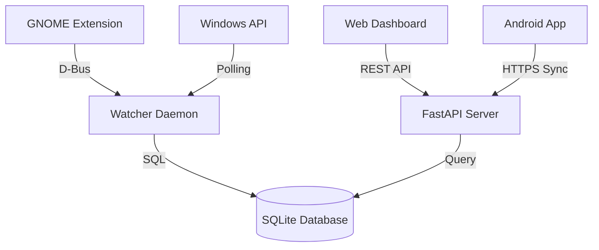

# Architecture

`atracker` is designed as a modular, local-first system. It consists of several components working together to track, store, and visualize activity.

## Component Overview

### 1. Watcher Daemon (`src/atracker/watcher.py` & `watcher_windows.py`)
The heart of the system. It runs an asynchronous loop that polls for the active window and idle state every 5 seconds (configurable).
- **Linux**: Uses the GNOME Shell extension via D-Bus as the primary source. Falls back to `xdotool` for XWayland windows if the extension is unavailable.
- **Windows**: Uses native Win32 APIs (`GetForegroundWindow`, `GetLastInputInfo`).

### 2. API Server (`src/atracker/api.py`)
A FastAPI server that runs on port `8932`. It serves the web dashboard and handles requests for event data, summaries, and history. It also acts as the sync target for the Android app.

### 3. Database (`src/atracker/db.py`)
A local SQLite database located at `~/.local/share/atracker/atracker.db`. It stores all events with UUID-based IDs to support future multi-device synchronization.

### 4. Web Dashboard (`dashboard/`)
A pure JavaScript/CSS/HTML dashboard that provides:
- **Timeline View**: Visual representation of the day's activity.
- **Usage Stats**: Top apps and categories.
- **History**: Activity trends over time.
- **Settings**: Manage categories and regex rules.

### 5. GNOME Extension (`gnome-extension/`)
Required for Wayland support. Standard window trackers cannot access window information in Wayland for security reasons. The extension exposes a D-Bus service that `atracker` queries.

### 6. Android App (`atracker-android/`)
A companion app that tracks foreground application changes on Android. It stores data locally and can sync to the desktop API.

## Data Flow
1. **Detection**: Watcher identifies active window + idle state.
2. **Buffering**: Watcher tracks how long the same window stays active.
3. **Commit**: When the active window changes or the app shuts down, the event is saved to SQLite.
4. **Visualization**: Dashboard polls the API for the latest events and renders them.
5. **Sync**: Android app periodically sends its events to the Desktop API.
