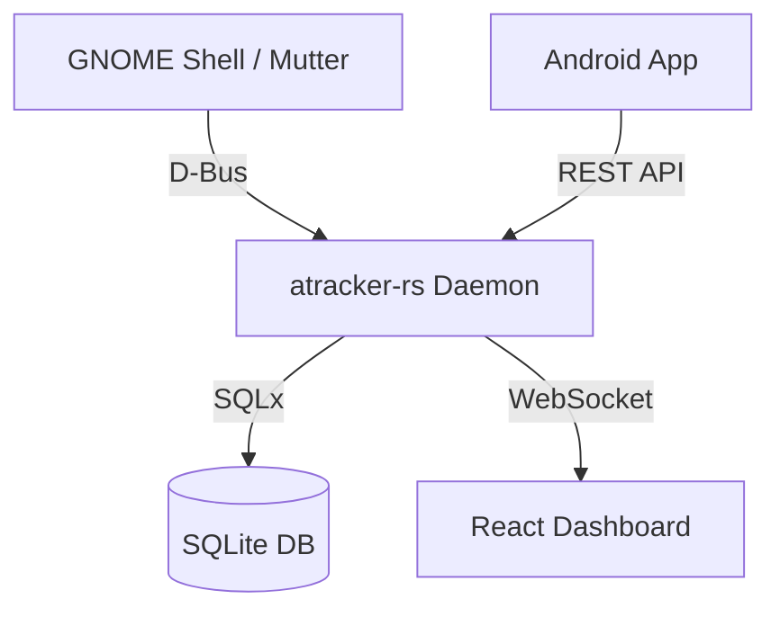

# System Architecture (v2)

This document describes the modern Rust-based architecture of `atracker`.

## Overview

The system consists of three main components running on the user's machine, plus an optional Android client.

```mermaid
graph TD
    GNOME[GNOME Shell / Mutter] -- D-Bus --> RS[atracker-rs Daemon]
    RS -- SQLx --> DB[(SQLite DB)]
    RS -- WebSocket --> UI[React Dashboard]
    Android[Android App] -- REST API --> RS
```

## 1. Backend: `atracker-rs`

Built with Rust, the backend is a single binary that serves multiple roles:

-   **Activity Watcher**: Polls active window information via D-Bus.
-   **Idle Monitor**: Communicates with `org.gnome.Mutter.IdleMonitor` to detect user inactivity.
-   **REST API**: Handles data queries, settings updates, and manual event creation using **Axum**.
-   **WebSocket Server**: Broadcasts real-time activity changes to the dashboard.
-   **Static File Server**: Serves the compiled React dashboard assets.

### Key Technologies
- **Axum**: High-performance web framework.
- **SQLx**: Asynchronous, type-safe SQL queries for SQLite.
- **ZBus**: Type-safe D-Bus communication.
- **Tokio**: Asynchronous runtime.

## 2. Frontend: `dashboard-v2`

A modern React application built with Vite.

-   **State Management**: React Hooks (`useTracker`) for data fetching and WebSocket synchronization.
-   **Visualizations**: Recharts for history and usage trends.
-   **Real-time**: Instant UI updates when window changes occur or idle state is detected.
-   **Aesthetics**: High-density "wealth management" design with a focus on data clarity and premium feel.

## 3. Data Storage

- **Database**: SQLite, stored at `~/.local/share/atracker-rs/atracker-rs.db`.
- **Isolation**: The Rust version uses a separate database from the legacy Python version, ensuring zero data contamination during migration.

## 4. Platform Integration (Linux)

- **GNOME Extension**: A minimal GJS extension (`gnome-extension/`) that exposes the current active window via a private D-Bus interface (`org.atracker.WindowTracker`).
- **Idle Tracking**: Uses the native Mutter D-Bus interface, requiring no additional setup on GNOME.

## 5. Android Integration

The Android app (`atracker-android`) periodically pushes usage data to the `/api/sync/android` endpoint. The backend merges this data into the same history views, allowing for a unified "Total Digital Usage" report.
