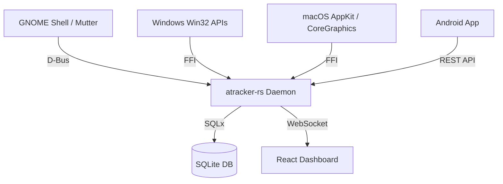

# System Architecture (v2)

This document describes the modern Rust-based architecture of `atracker`.

## Overview

The system consists of three main components running on the user's machine, plus an optional Android client. The same Rust daemon runs on Linux, Windows, and macOS — only the platform-integration layer in `watcher.rs` differs.

```mermaid
graph TD
    GNOME[GNOME Shell / Mutter] -- D-Bus --> RS[atracker-rs Daemon]
    Win[Windows Win32 APIs] -- FFI --> RS
    Mac[macOS AppKit / CoreGraphics] -- FFI --> RS
    RS -- SQLx --> DB[(SQLite DB)]
    RS -- WebSocket --> UI[React Dashboard]
    Android[Android App] -- REST API --> RS
```

## 1. Backend: `atracker-rs`

Built with Rust, the backend is a single binary that serves multiple roles:

-   **Activity Watcher**: Polls active window information via the platform's native API (see [Platform Integration](#4-platform-integration)).
-   **Idle Monitor**: Detects user inactivity via the platform-appropriate idle source.
-   **REST API**: Handles data queries, settings updates, and manual event creation using **Axum**.
-   **WebSocket Server**: Broadcasts real-time activity changes to the dashboard.
-   **Static File Server**: Serves the compiled React dashboard assets.

### Key Technologies
- **Axum**: High-performance web framework.
- **SQLx**: Asynchronous, type-safe SQL queries for SQLite.
- **ZBus** (Linux only): Type-safe D-Bus communication.
- **Tokio**: Asynchronous runtime.

## 2. Frontend: `dashboard-v2`

A modern React application built with Vite.

-   **State Management**: React Hooks (`useTracker`) for data fetching and WebSocket synchronization.
-   **Visualizations**: Recharts for history and usage trends.
-   **Real-time**: Instant UI updates when window changes occur or idle state is detected.
-   **Aesthetics**: High-density "wealth management" design with a focus on data clarity and premium feel.

## 3. Data Storage

- **Database**: SQLite, stored at `~/.local/share/atracker-rs/atracker-rs.db`.
- **Isolation**: The Rust version uses a separate database from the legacy Python version, ensuring zero data contamination during migration.

## 4. Platform Integration

All platform-specific code lives in `atracker-rs/src/watcher.rs`, gated by `#[cfg(target_os = ...)]`. Each backend implements the same two primitives — *get foreground window* and *get idle time in milliseconds* — and the rest of the watcher pipeline is shared.

### Linux

- **GNOME Extension**: A minimal GJS extension (`gnome-extension/`) that exposes the current active window via a private D-Bus interface (`org.atracker.WindowTracker`).
- **Idle Tracking**: Uses the native Mutter D-Bus interface (`org.gnome.Mutter.IdleMonitor`), requiring no additional setup on GNOME.
- **Transport**: D-Bus via the `zbus` crate.

### Windows

- **Active Window**: Direct Win32 FFI — `GetForegroundWindow` → `GetWindowTextW` for the title, plus `GetWindowThreadProcessId` → `OpenProcess` → `QueryFullProcessImageNameW` for the executable name (lower-cased, `.exe` stripped, used as `wm_class`).
- **Idle Tracking**: `GetLastInputInfo` + `GetTickCount64`.
- **Transport**: Raw `extern "system"` declarations against `user32.dll` and `kernel32.dll` — no third-party crates.

### macOS

- **Active Window**: Raw `objc_msgSend` calls into `[[NSWorkspace sharedWorkspace] frontmostApplication]` to read the active app's `bundleIdentifier`, `localizedName`, and `processIdentifier`. `wm_class` is the bundle id (lower-cased), falling back to the localized name.
- **Window Title**: `CGWindowListCopyWindowInfo(kCGWindowListOptionOnScreenOnly | kCGWindowListExcludeDesktopElements, kCGNullWindowID)` returns the on-screen window list ordered front-to-back. We pick the first dictionary whose `kCGWindowOwnerPID` matches the frontmost app and whose `kCGWindowLayer == 0`, then read `kCGWindowName`. Without **Screen Recording** permission, `kCGWindowName` is absent — we fall back to the app's localized name.
- **Idle Tracking**: `CGEventSourceSecondsSinceLastEventType(kCGEventSourceStateHIDSystemState, kCGAnyInputEventType)` from CoreGraphics.
- **Transport**: Raw FFI to `libobjc`, `CoreGraphics`, `CoreFoundation`, and AppKit (linked via `atracker-rs/build.rs` so `objc_getClass("NSWorkspace")` resolves at runtime). CFString keys are allocated with `CFStringCreateWithCString` and explicitly `CFRelease`d; autoreleased NSStrings from the NSWorkspace path are drained via an `NSAutoreleasePool` per poll.
- **Service**: Installed by `install.sh` as a `launchd` LaunchAgent at `~/Library/LaunchAgents/com.atracker.atracker-rs.plist` with `RunAtLoad` + `KeepAlive`. Logs to `~/Library/Logs/atracker-rs.log`.

## 5. Android Integration

The Android app (`atracker-android`) periodically pushes usage data to the `/api/sync/android` endpoint. The backend merges this data into the same history views, allowing for a unified "Total Digital Usage" report.
